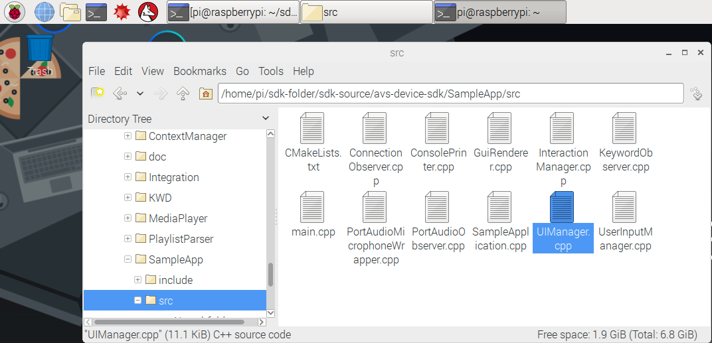
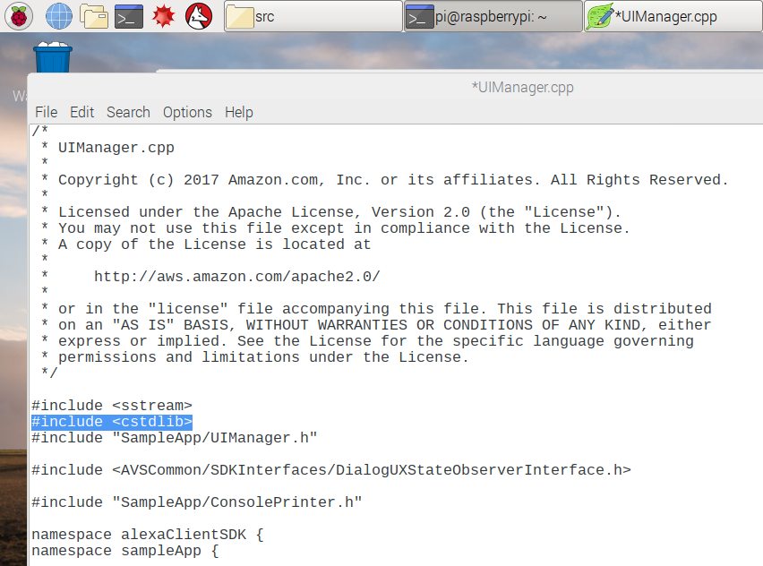
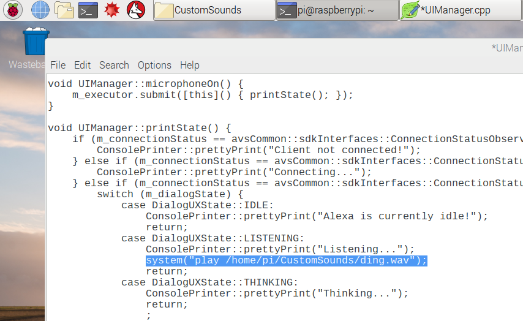

### Modify your UImanager file

If you're speaking to an Alexa-enabled device, you may want an indicator that your wake word was heard.  In some cases, this may be an LED activating or changing color on the device.  But what if you can't see the device?  In this case, you may want your device to play an audio cue to confirm when Alexa hears you.  In this step, you'll modify the **User Interface Manager** to play a **Ding!** each time Alexa's state changes to **LISTENING**.

Navigate to */home/pi/sdk-folder/sdk-source/avs-device-sdk/SampleApp/src/* and open UIManager.cpp with a text editor.

At the top of the file where you see the other #include statements, add: `#include <cstdlib>`  This will enable your play function that you'll add in the next step.

Your OS image includes a folder at /home/pi/CustomSounds populated with a sample .wav file to use for this exercise.  You'll need to add a path to this sound to enable your audio cue.  Near the bottom of the UIManager file in the `printState()` function, where it says `case DialogUXState::LISTENING:` add the following command:

`system("play /home/pi/CustomSounds/ding.wav");`

Save your text file before closing it.  You'll need to download **sox** to play the audio file, and rebuild the Sample App for the changes to take effect.  First, quit out of your existing instance of the Sample App (if it's still running) by typing "**q**"
and hitting **return**.  
Open a terminal and type: 

`sudo apt-get install sox`

Hit "y" to accept the install terms, it should only take a couple of seconds to download.

Now, in your terminal you can input the following command to rebuild the Sample App:

`cd /home/pi/sdk-folder/sdk-build/SampleApp
make
`

You'll notice the files you've changed have to rebuild, but it should only take a minute.  When you get to 100%, relaunch your Sample App by initiating the **startsample.sh** script in a terminal:

`cd /home/pi/sdk-folder
sudo bash startsample.sh
`

{:.verify}
### Checkpoint 11

Every time you speak the wake word "Alexa" to your prototype (Alexa's state changes to **Listening...**) you should hear your custom sound play, indicating that Alexa has opened a channel to the cloud and is ready for your request.  If you get an error, remember you can hit **s** and return to stop any interaction and try again.  Go online and find new .wav files - experiment with different sounds at various states in the UI manager!

When you ship your product, your customers will expect their user experience to be consistent across any Alexa-enabled device.  You can learn best practices for implementing visual and audio cues on your device by visiting the [AVS UX Design overview page](https://developer.amazon.com/docs/alexa-voice-service/ux-design-overview.html).

---
