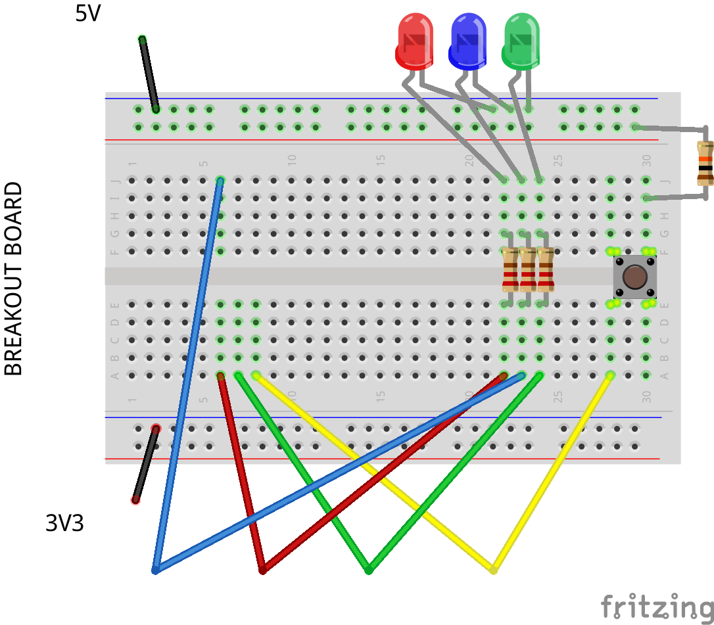
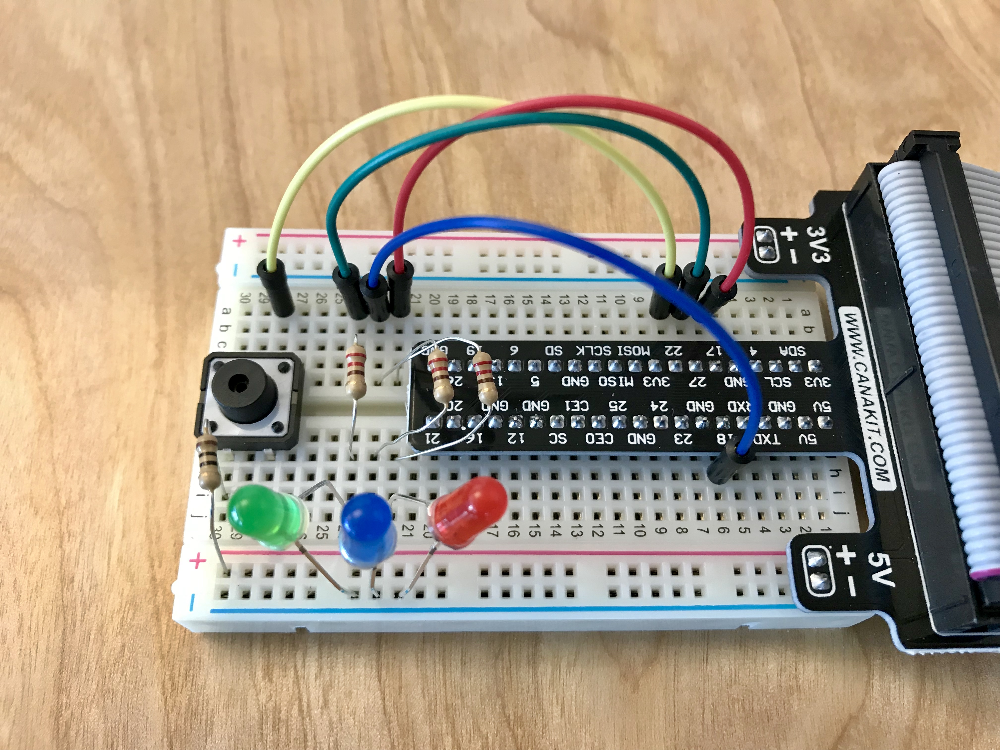
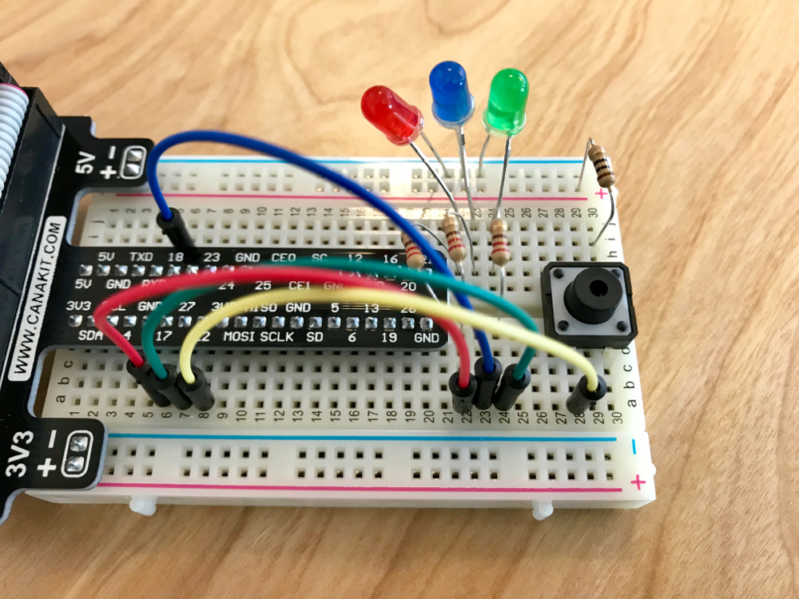

###	Hardware assembly

Refer to the pictures below for the hardware assembly.

1. Shut down your Pi from the desktop menu, and disconnect the power cable.
2. Attach the GPIO breakout board to the breadboard.
3. Attach the ribbon cable to the GPIO breakout board.
4. Attach the other end of the ribbon cable to the 40 pin header on the Pi.
5. Place the red, green and blue LEDs on the breadboard. The shorter pin of the LEDs should be -5V line.
6. Place the 220 Ohms (red-red-black-gold) LED resistors on the breadboard.
7. Please the 3 red,greeen, and blue colored jumper wires linking the GPIO pins controlling the LEDs on the breadboard. Use the table below as a guide.
8. Place the switch on the breadboard.
9. Pleace the 10k Ohms (brown-black-orange-gold) pull-down resistor for the switch on the breadboard. 
9. Place the yellow jumper wire linking the switch to the GPIO pin on the breadbord. Use the table below as a guide.

 

## Breadboard connection table

Raspberry Pi Pin Number | BCM pin number | Module Pin | Switch | Pull-down resistor
 :---: | :---: | :---: | :---: | :---: 
6| - | GND | - | Pin1
11|	17|	R|	-|	-
12|	18|	B|	-|	-
13|	27|	G|	-|	-
1|	-|	-|	Pin 1|	-
15|	22|	-|	Pin 2|	Pin2

Here, in the table, in the first column, these are the physical pin numbers of the Raspberry Pi, and in the second column the pin numbers according to the BCM numeration as our GPIO library will use it.

