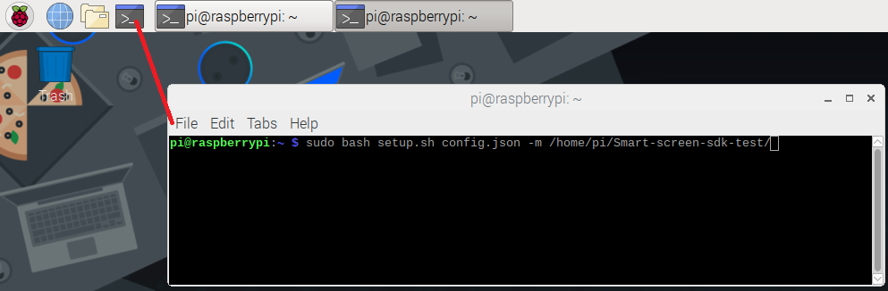

### Run the Setup script

You are now ready to run the setup script. This will install the required software and dependencies on your Pi. To run the setup script, open a **terminal** by clicking on the console window in the Pi's toolbar in the upper-left corner of the screen (or just use your existing terminal window).

```
cd /home/pi
wget https://avs-dvk-workshop.github.io/setup_files/avs_pre_setup.sh
bash avs_pre_setup.sh
```


### Run the Install Script

You are now ready to run the install script. This will install all dependencies, including the **Wake Word Engine** (WWE) from Sensory.  The WWE compares incoming audio to an onboard model of a wake word (**"Alexa"**) and will initiate the transmission of audio to the cloud when triggered.  Note that this WWE is provided for **prototyping purposes only** and would need to be licensed for a commercial device.  The AVS Device SDK is modular and flexible. When you're ready to build your product, you can choose any WWE you prefer. Remember that for AVS products, the wake word must be **Alexa** so that your customers aren't confused about how to interact with your device.

To run the install script, open a **terminal** by clicking on the console window in the Pi's toolbar in the upper-left corner of the screen (or just use your existing terminal window). You should see a **avs_install.sh** script in your */home/pi/* directory. This pulls the credentials from your **config.json** file to run the install script. To launch the install script, copy and paste the following commands into your terminal window and hit return:


```
cd /home/pi
bash avs_install.sh
```





Type **"AGREE"** when it prompts you to accept the licensing terms from our third-party libraries.  Unless, of course, you disagree!

This will kick off the installation process which could normally take over 20 minutes.

Once the installation is finished, you should see a return to the shell prompt and no abvious compilation errors.  If your device freezes up - don't worry, just restart by unplugging your Pi's power cord.  When you get back to your desktop, re-run the above `avs_install.sh` command to finish your install. If you need to recompile the sdk at some point post-workshop due to an update or manual modification, you should close any other processes like browsers on the pi as memory consumption during the compilation process is high.


Now you just need to launch the sample app and get a refresh token from AVS so your device can authenticate with the cloud via Login With Amazon (LWA).  


