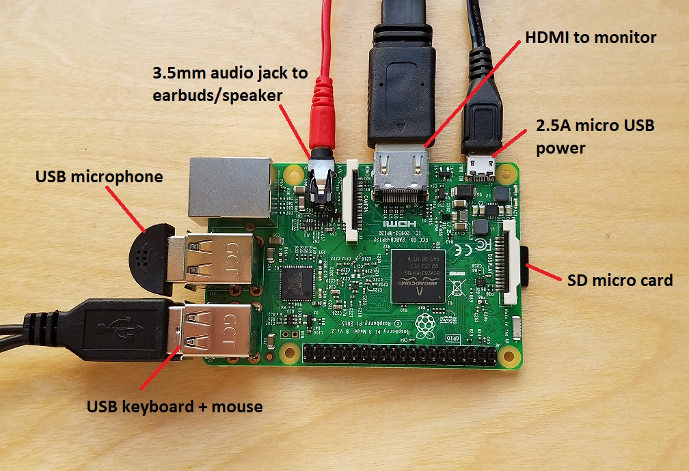

**Note:  you can skip this step if your Pi is already up and running.**

### Equipment needed

- Raspberry pi 3 with power supply
- 16GB+ micro SD Card with raspbian Stretch installed
- Raspberry Pi compatible GPIO breakout board and cable
- Breadboard
- 3x LEDs: Red, White and Blue
- 1x push button switch
- 3x 220 ohm resistors
- 1x 10k ohm resistor
- Colored Jumper cables

This contains all of the above: [https://www.amazon.com/CanaKit-Raspberry-Ultimate-Starter-Clear/dp/B07BC567TW](https://www.amazon.com/CanaKit-Raspberry-Ultimate-Starter-Clear/dp/B07BC567TW)

- USB Microphone
- 3.5mm jack headphones
- USB Keyboard
- USB Mouse
- Monitor and Cable that accepts HDMI input

Let's begin by setting up the Pi. The Raspberry Pi 3 board includes -

- 4 USB ports
- HDMI port for video output (you'll be using this to connect to your HDMI monitor)
- 3.5mm audio jack for sound output (you'll be using to connect your earphones)
- Micro SD card slot
- Ethernet port

{:.steps}
### Assembling Your Pi

Let's begin by setting up the Pi. The Raspberry Pi 3 board includes -

- 4 USB ports
- HDMI port for video output (you'll be using this to connect to your HDMI monitor)
- 3.5mm audio jack for sound output (you'll be using to connect your earphones)
- Micro SD card slot
- Ethernet port

1. Install the heat sinks included in your kit. Peel off the blue plastic on the heat sinks, then place them on the two integrated circuits on the Pi, pressing gently.
2. Install Raspbian Stretch on your micro SD card and install it into the micro SD card slot on your Pi.
3. Plug in the USB microphone and 3.5mm earbuds.
4. Connect the keyboard and mouse to the USB ports.
5. Connect your monitor using the HDMI port.
6. Insert ethernet cable into the Pi if using ethernet to connect to the internet.  (not shown in this picture)

{:.steps}
### Booting Your Pi

1. Plug in the power supply to the micro USB connector on the Pi.  You should see a loading screen go through some startup steps before booting to desktop - if you run into any errors, request a new SD micro card to boot the OS from.
2. If using the ethernet connection, verify ethernet is working by clicking on the connectivity icon in the top right of the tool bar (next to the speaker icon). If you are using WiFi connectivity, setup the connection. You should see an up/down arrow pair (not X'd out).
3. Open a web browser by clicking on the globe icon in the top left toolbar.

{:.verify}
### Checkpoint 1
1. Make sure you're connected to the internet and are able to navigate to [https://developer.amazon.com](https://developer.amazon.com).
